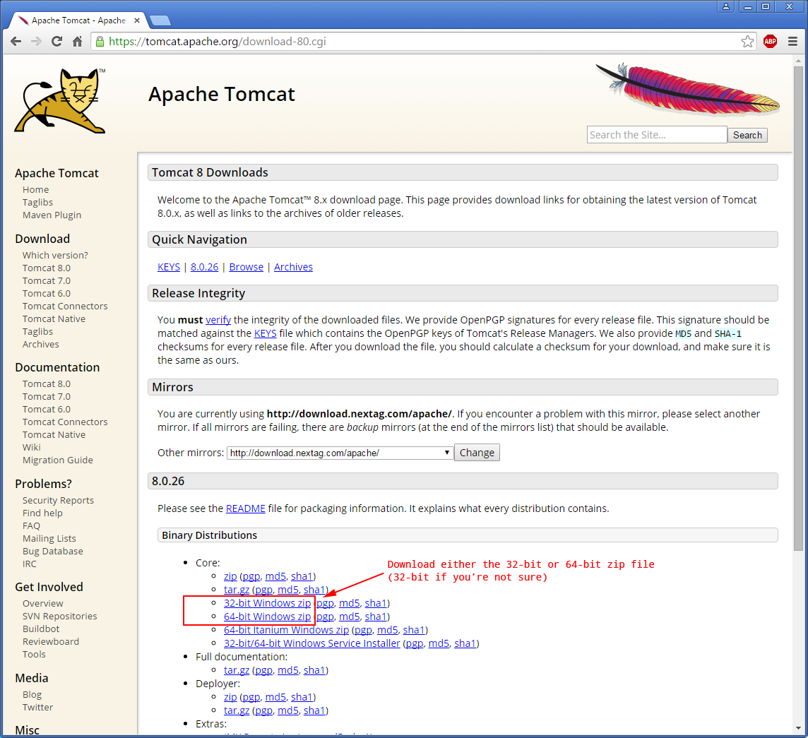
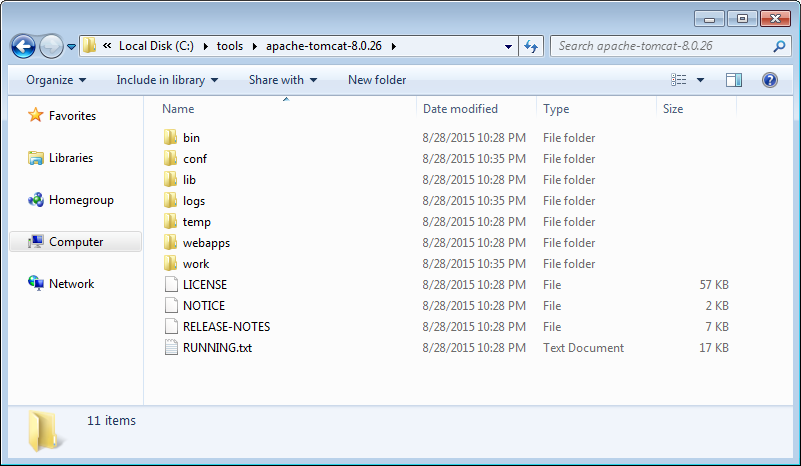
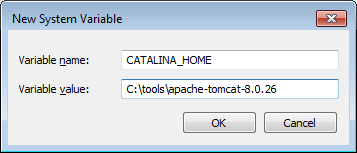
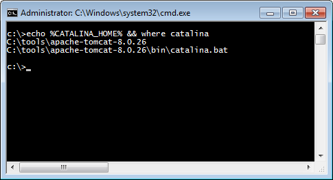
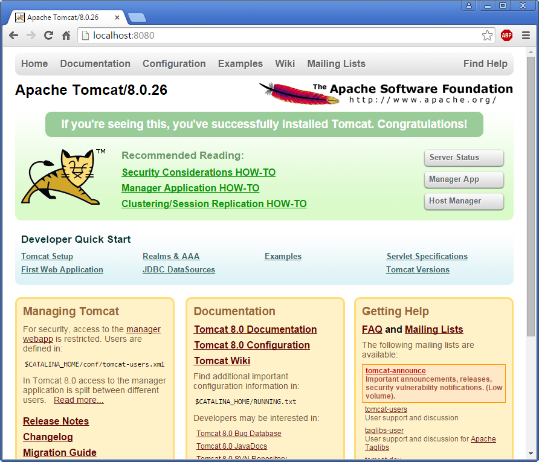
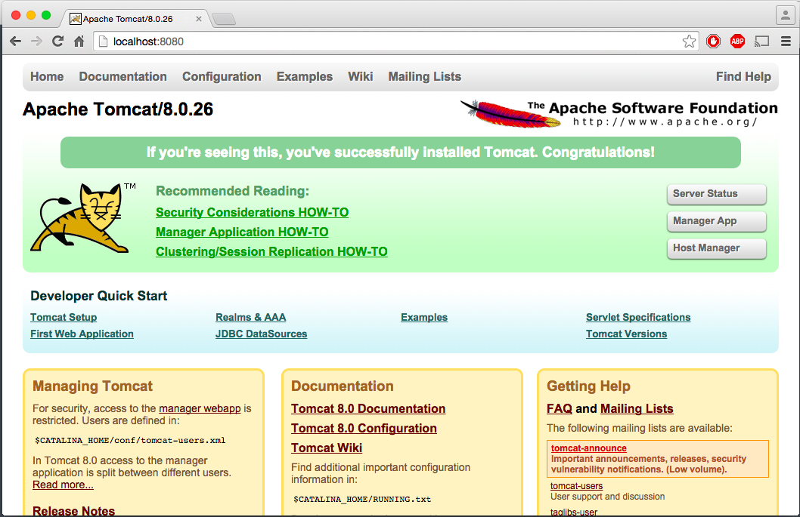

# Setting Up and Running Tomcat

Before you can run your [FreeMarker](http://freemarker.org) webapp, you’ll need to start a server locally. This tutorial will go over a basic [Apache Tomcat](http://tomcat.apache.org/) configuration for your local machine.

## Prerequisites

This tutorial assumes you have some basic knowledge of programming concepts and problem solving skills.

You will also need a computer with admin/root access.

## Disclaimer

This tutorial is simply a guide to get a server up and running for *local development*. This tutorial should **by no means** be used as a reference for setting up an enterprise webapp. This tutorial is not being written from the perspective of a security expert and should not be treated as such. Again: This information is only for the purpose of local development.

Alright. Now that we have that out of the way—let’s move on.

## Why Tomcat?

Many different servers will run JEE webapps and they all have their various pros and cons. I’ve found Tomcat easy to configure and I like how quickly it starts up. (I’m sure other web servers are also easy to configure and start up just as quickly.)

You are more than welcome to use another sever, such as [JBoss](http://www.jboss.org/) or [GlassFish](https://glassfish.java.net/), but all these tutorials will be referencing Tomcat paths.

## Download and Install Tomcat

At the time of this writing, the latest stable version of Tomcat is 8.0.26.

### Windows Users

(Based on Windows 7)

**Note: Make sure *all* your Command Prompt windows are closed before you start this tutorial.**

1. On the [Tomcat download page](http://tomcat.apache.org/download-80.cgi), under Binary Distributions > Core, download the either the 32-bit or 64-bit Windows zip. (If you aren’t sure if your system is 32-bit or 64-bit, download the 32-bit version.)

    

2. Extract the zip somewhere you’ll remember, like `C:\tools\apache-tomcat-8.0.26` (Make sure it’s not `C:\tools\apache-tomcat-8.0.26\apache-tomcat-8.0.26`!!!):

    

3. Open up environment variables ([tutorial on how to access your environment variables](../00-updating-environment-variables)) and set `CATALINA_HOME` equal to the place where you just extracted your zip file:

    

4. Next we have to add `CATALINA_HOME` to our path. In environment variables, find the Path variable and edit it:

    

5. At the end of “Variable value” add `;%CATALINA_HOME%\bin` (Don’t forget the semi-colon!)

    

6. Click “OK” and “OK” again and “OK” one last time to exit out of environment variables.

7. Open up command prompt and type `echo %CATALINA_HOMEx% && where catalina` and you should see something like this:

    

    If you do not see this you may have had a command prompt open while editing your environment variables and you will need restart your computer and try again.

8. Open up Command prompt and type `catalina start`. You should see a console window open.

  * (If you get an error like `'startup' is not recognized as an internal or external command`, log in and out and that should fix it)
  * Note: A notification from Windows firewall may pop up. It’s safe to allow access for private networks.

9. Open your favorite web browser and navigate to [http://localhost:8080/](http://localhost:8080/). You should see something like this:

    

### OS X Users

1. If you haven’t already done so, install [Homebrew](http://brew.sh/). Homebrew is similar to [APT](https://en.wikipedia.org/wiki/Advanced_Packaging_Tool) and facilitates easier package management.

2. Open up Terminal and install Tomcat with Homebrew:

    ```bash
    brew update
brew install tomcat
    ```

3. Once installation is complete, in Terminal start up Tomcat by running `catalina start`

4. Open your favorite web browser and navigate to [http://localhost:8080/](http://localhost:8080/). You should see something like this:<br><br> 

## Conclusion

Remember where you installed Tomcat! We will need to update the configuration in the next tutorial.

## Next Steps

Continue to the next tutorial: [FreeMarker “Hello World”](../01-hello-world)
