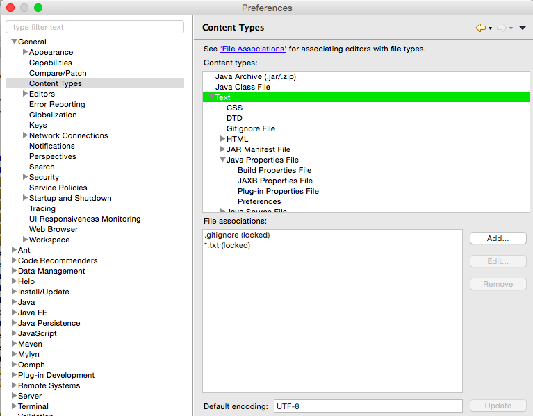

# FreeMarker Hello World

Here we will set up a very basic FreeMarker webapp using [Spring MVC](http://spring.io/).  We will also be using [Java-based Spring configuration](http://docs.spring.io/spring/docs/current/spring-framework-reference/html/beans.html#beans-java). (Legacy Spring MVC apps may still use xml-based Spring configuration, but this is not recommended for new projects.)

This tutorial assumes you have a Tomcat server running locally (or a server you’re comfortable configuring on your own.)

If you aren’t sure how to run Tomcat locally, please review the [Running a server locally](../00-running-a-server-locally) tutorial.

**Libraries Used**

* [FreeMarker 2.3.23](http://freemarker.org/docs/)
* [Spring MVC 4.2](https://spring.io/blog/2015/07/31/spring-framework-4-2-goes-ga)
* Javax Servlet API 3.1.0

## Tutorial notes

This project contains mostly the *minimum* dependencies for a FreeMarker webapp. Other staple dependencies like [log4j](http://logging.apache.org/log4j/2.x/) and [Joda time](http://www.joda.org/joda-time/) will be used in subsequent tutorials.

First we will set up and run the project, then we will go into details on what each file does.

### UTF-8

Everything in this project will be configured using UTF-8 charset. When making a new webapp, it is crucial you set up your project to have consistent UTF-8 file encodings.

If you don’t, you risk your site having embarrassing encoding issues (ever seen a site with words like "don’t" instead of "don’t"? Yeah, awkward.) It’s also a huge pain to go back and fix encoding issues, so just use **UTF-8 for everything from the start**.

Every editor is different and some set different default encodings for different file types. For example if you’re using Eclipse, go through **each file type** and make sure the default encoding is set to UTF-8 for each extension:



## Step 1: Download or clone the FreeMarker Tutorials project

[Download and extract the FreeMarker Tutorials Github project](https://github.com/freemarker/tutorials/archive/master.zip) or clone it using git (`git clone https://github.com/freemarker/tutorials.git`)

## Step 2: Compile the Hello World project

Open up a console window (Command prompt for Windows users or Terminal for OS X users) and navigate to the `tutorials/01-hello-world` directory. Run `mvn compile war:inplace`.

```bsh
mvn compile war:inplace
```

(If you don’t have Maven, follow the installation instructions here: [Installing Java and Maven](../00-installing-java-and-maven/))

This will download the dependencies and compile the Java files.

## Step 3: Point Tomcat at your webapp directory

In the [previous tutorial](../00-running-a-server-locally) we set up a Tomcat server. Make sure your server is still running!

* Windows users: Open up command prompt, type `startup` and press enter
* OS X users: Open up terminal, type `catalina start` and press enter

Navigate to your Tomcat installation folder, and find the `conf/Catalina/localhost` directory and create a context file called **hello-world.xml**.

If you followed the previous tutorial’s instructions, Windows users can navigate directly to the folder by copying and pasting `%CATALINA_HOME%\conf\Catalina\localhost` into a Windows explorer window.


OS X users can do this in terminal (Replace **8.0.26** with your version of Tomcat):

```bsh
cd /usr/local/Cellar/tomcat/8.0.26/libexec/conf/Catalina/localhost
vi hello-world.xml
```

Inside `hello-world.xml`, add the following (Replace **PATH_TO_FREEMARKER_TUTORIALS** with
    wherever you have the FreeMarker tutorials project.:

```xml
<?xml version="1.0" encoding="utf-8"?>
<Context docBase="PATH_TO_FREEMARKER_TUTORIALS/01-hello-world/src/main/webapp" path="" reloadable="true" />
```

You should now be able to access the FreeMarker Hello World webapp at [http://localhost:8080/hello-world/](http://localhost:8080/hello-world/).


### A note about context files

It is important to note that the **/hello-world/** part of the URL is **based on the name of the XML file we created**. If we renamed `hello-world.xml` to `banana-bunnies.xml`, then our webapp would be accessible at http://localhost:8080/banana-bunnies/.  If you wanted to deploy the webapp to http://localhost:8080, you would rename the xml file to (case-sensitive) `ROOT.xml`.

Context files are convenient because you can deploy different webapps to the same domain without needing to redeploy the whole domain.

For example, if you had a website with a “Special Offers” section, you could separate it into it’s own webapp and deploy the `special-offers` app without affecting the main website.

* http://example.com - Runs off `ROOT.xml`
* http://example.com/special-offers/ - Runs off `special-offers.xml`

## Step 4: Digging into the files

First, a summary of the files and directories:

```
01-hello-world/
  src/
    java/
      FreeMarkerTutorials/
        config/
          AppConfig.java
          CustomFreeMarkerView.java
          CustomFreeMarkerViewResolver.java
          WebMvcConfig.java
        controller/
          HelloWorld.java
        AppInitializer.java
    main/
      webapp/
        static/
          css/
            styles.css
          js/
            hello-world.js
        WEB-INF/
          ftl/
            private/
              hello-world.ftl
            templates/
              globals.ftl
              include-common.ftl
          404.html
          error.html
          web.xml
```

All JEE webapps should follow the `src/main/java` and `src/main/webapp` directory structure. (Normally there is another folder named `src/main/resources` but we don’t need that for this project.)

### web.xml, 404.html, error.html

Sources:

* [web.xml](src/main/webapp/WEB-INF/web.xml)
* [404.html](src/main/webapp/WEB-INF/404.html)
* [error.html](src/main/webapp/WEB-INF/error.html)

Web.xml is required by Tomcat ([read more here if you’re curious](http://wiki.metawerx.net/wiki/Web.xml).) The inside of `<web-app></web-app>` can be empty, but I used it to define the error pages:

```xml
<?xml version="1.0" encoding="UTF-8"?>
<web-app xmlns="http://xmlns.jcp.org/xml/ns/javaee" xmlns:xsi="http://www.w3.org/2001/XMLSchema-instance" xsi:schemaLocation="http://xmlns.jcp.org/xml/ns/javaee http://xmlns.jcp.org/xml/ns/javaee/web-app_3_1.xsd" version="3.1" metadata-complete="true">
    <error-page>
        <error-code>404</error-code>
        <location>/WEB-INF/404.html</location>
    </error-page>
    <error-page>
        <location>/WEB-INF/error.html</location>
    </error-page>
</web-app>
```

### AppInitializer.java

AppInitializer.java ([source](src/main/java/FreeMarkerTutorials/AppInitializer.java)) tells Spring where to look for the webapp configuration. Historically this was handled by a `servlet.xml` file. Pretty standard stuff—not much to see here. (You would have this file for any Spring MVC project)

```java
public class AppInitializer implements WebApplicationInitializer {

    @Override
    public void onStartup(ServletContext servletContext) throws ServletException {
        WebApplicationContext context = getContext();
        servletContext.addListener(new ContextLoaderListener(context));
        ServletRegistration.Dynamic dispatcher = servletContext.addServlet("DispatcherServlet", new DispatcherServlet(context));
        dispatcher.setLoadOnStartup(1);
        dispatcher.addMapping("/");
    }

    private AnnotationConfigWebApplicationContext getContext() {
        AnnotationConfigWebApplicationContext context = new AnnotationConfigWebApplicationContext();
        context.setConfigLocation("FreeMarkerTutorials.config"); // this maps to src/main/java/FreeMarkerTutorials/config/
        return context;
    }
}
```

### AppConfig.java

AppConfig.java ([source](src/main/java/FreeMarkerTutorials/config/AppConfig.java)) is pretty boring. It just tells Spring where to look for the `@Configuration` classes.

```java
@Configuration
@ComponentScan(basePackages = "FreeMarkerTutorials")
public class AppConfig {

}
```

### WebMvcConfig.java

WebMvcConfig.java ([source](src/main/java/FreeMarkerTutorials/config/WebMvcConfig.java))
