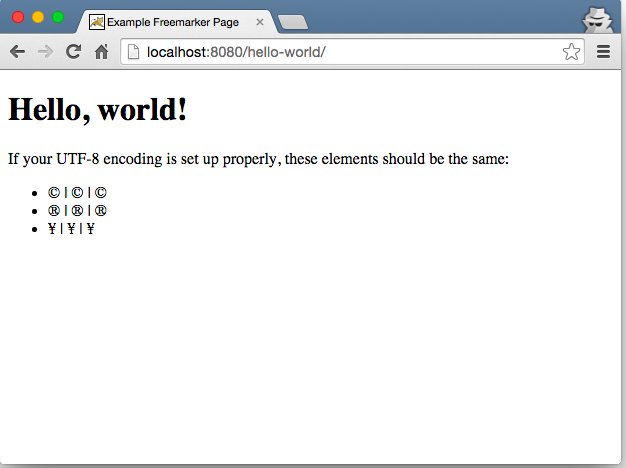

# FreeMarker Hello World

Here we will set up a very basic FreeMarker webapp using [Spring MVC](http://spring.io/).  We will also be using [Java-based Spring configuration](http://docs.spring.io/spring/docs/current/spring-framework-reference/html/beans.html#beans-java). (Legacy Spring MVC apps may still use xml-based Spring configuration, but this is not recommended for new projects.)

This tutorial assumes you have a Tomcat server running locally (or a server you’re comfortable configuring on your own.)

If you aren’t sure how to run Tomcat locally, please review the [Running a server locally](../00-running-a-server-locally) tutorial.

**Libraries Used**

* [FreeMarker 2.3.23](http://freemarker.org/docs/)
* [Spring MVC 4.2](https://spring.io/blog/2015/07/31/spring-framework-4-2-goes-ga)
* Javax Servlet API 3.1.0

## Tutorial notes

This project contains mostly the *minimum* dependencies for a FreeMarker webapp. Other staple dependencies like [log4j](http://logging.apache.org/log4j/2.x/) and [Joda time](http://www.joda.org/joda-time/) will be used in subsequent tutorials.

First we will set up and run the project, then we will go into details on what each file does.

### UTF-8

Everything in this project will be configured using UTF-8 charset. When making a new webapp, it is crucial you set up your project to have consistent UTF-8 file encodings.

If you don’t, you risk your site having embarrassing encoding issues (ever seen a site with words like "don’t" instead of "don’t"? Yeah, awkward.) It’s also a huge pain to go back and fix encoding issues, so just use **UTF-8 for everything from the start**.

Every editor is different and some set different default encodings for different file types. For example if you’re using Eclipse, go through **each file type** and make sure the default encoding is set to UTF-8 for each extension:


## Step 1: Download or clone the FreeMarker Tutorials project

[Download and extract the FreeMarker Tutorials Github project](https://github.com/freemarker/tutorials/archive/master.zip) or clone it using git (`git clone https://github.com/freemarker/tutorials.git`)

## Step 2: Compile the Hello World project

Open up a console window (Command prompt for Windows users or Terminal for OS X users) and navigate to the `tutorials/01-hello-world` directory. Run `mvn compile war:inplace`.

```bsh
01-hello-world> mvn compile war:inplace
```

This will download the dependencies and compile the Java files.  We use `war:inplace` so that Maven puts the compiled Java resources and libraries in the webapp directory instead of copying everything to a separate `/target/` directory.  More on this in the next step.

### Short Maven overview

If you already know what Maven is you can skip this whole section.

If you don’t know what Maven is, I’ll only give a short explanation here as there are a lot of other Maven resources out there.

If you’ve used [NPM](https://www.npmjs.com/) or [Ant+Ivy](http://ant.apache.org/ivy/) or [Gradle](https://gradle.org/) or [NuGet](https://www.nuget.org/) or [Composer](https://getcomposer.org/) then know that Maven is similar to those tools.

Maven ensures developers working on a project together are using the same dependencies. It handles downloading dependencies and putting them in a consistent location where your Java compiler can find them. It is also used to bundle JAR and WAR files, and can be used to version your own projects.

Maven looks for a `pom.xml` file in the root of your project and runs commands based on what is in that file. (There are more elaborate ways to set up Maven builds, but since this is a FreeMarker tutorial and not a Maven tutorial, that topic won’t be covered.)

In summary: We’ll be using Maven to download dependencies and build our Java project.

## Step 3: Point Tomcat at your webapp directory

In the [previous tutorial](../00-running-a-server-locally) we set up a Tomcat server. Make sure your server is still running!

* Windows users: Open up command prompt, type `startup` and press enter
* OS X users: Open up terminal, type `catalina start` and press enter

Navigate to your Tomcat installation folder, and find the `conf/Catalina/localhost` directory and create a context file called **hello-world.xml**.

If you followed the previous tutorial’s instructions, Windows users can navigate directly to the folder by copying `%CATALINA_HOME%\conf\Catalina\localhost` into a Windows explorer window.


OS X users can do this in terminal (Replace **8.0.26** with your version of Tomcat):

```bsh
cd /usr/local/Cellar/tomcat/8.0.26/libexec/conf/Catalina/localhost
vi hello-world.xml
```

Inside hello-world.xml, add the following:

```xml
<?xml version="1.0" encoding="utf-8"?>
<!-- Replace PATH_TO_FREEMARKER_TUTORIALS with
    wherever you have the FreeMarker tutorials project. -->
<Context
  docBase="PATH_TO_FREEMARKER_TUTORIALS/01-hello-world/src/main/webapp"
  path=""
  reloadable="true" />
```

This is where `war:inplace` comes in handy. By pointing at the `/src/main/webapp` folder, we do not have to recompile the project every single time we make a change to a frontend file (e.g. CSS, JavaScript, or FreeMarker).

If you make a change a Java file, you will still need to recompile with `mvn compile war:inplace` to see your updates.

(Disclaimer: The above configuration should NOT be used for a production webapp. This is just for local development. There are many [configuration options for securing your Tomcat server](https://tomcat.apache.org/tomcat-8.0-doc/security-howto.html#Context), and you should read about it before you deploy anything.)

You should now be able to access the FreeMarker Hello World webapp at [http://localhost:8080/hello-world/](http://localhost:8080/hello-world/).



### A note about context files

The **/hello-world/** part of the URL is based on the name of the XML file we created. If we renamed `hello-world.xml` to `banana-bunnies.xml`, then our webapp would be accessible at http://localhost:8080/banana-bunnies/.  If you wanted to deploy the webapp to http://localhost:8080, you would rename the xml file to (case-sensitive) `ROOT.xml`.

Context files are convenient because you can deploy different webapps to the same domain without needing to redeploy the whole domain.

For example, if you had a website with a “Special Offers” section, you could separate it into it’s own webapp and deploy the `special-offers` app without affecting the main website.

* http://example.com - Runs off `ROOT.xml`
* http://example/special-offers/ - Runs off `special-offers.xml`
